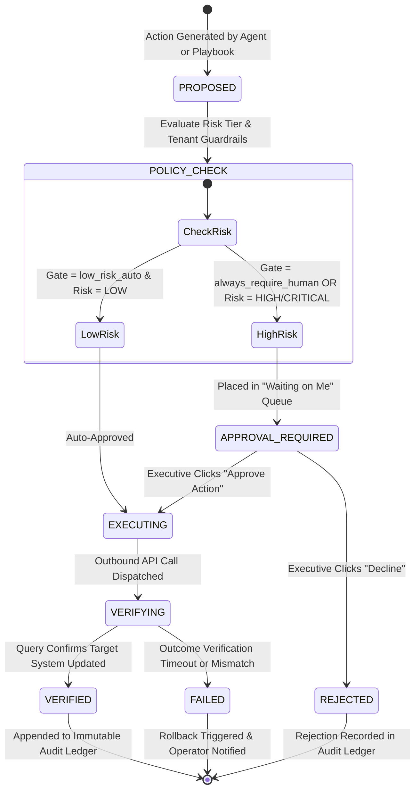

# SignalDesk — Safe Action Gateway & Governance Specification

**Document Identifier**: `DOC-GOV-2026-V1`  
**Status**: `CANONICAL`  
**Owner**: Governance, Risk & Information Security  
**Last Verified Against Implementation**: 2026-10-05  

---

## 1. Operating Principle: "Don't Just Act. Prove the Outcome."

In traditional automation platforms, executing an action is considered successful the moment the outbound HTTP request returns 200. SignalDesk rejects this assumption.

In enterprise business operations, a webhook can be acknowledged but rejected asynchronously, an API token can have silent write-permission boundaries, or an updated CRM record can fail validation rules. SignalDesk enforces the **Safe Action Gateway**: an action is never marked completed until its post-mutation outcome is verified directly against the authoritative source system.



---

## 2. Cryptographic Approval Binding

When an action enters `APPROVAL_REQUIRED`, SignalDesk constructs a cryptographically bound approval context:

```typescript
export interface BoundApprovalContext {
  actionId: string;              // Unique idempotency identifier
  tenantId: string;              // Strict organizational boundary
  targetSystem: string;          // e.g. "stripe", "hubspot", "jira"
  actionType: string;            // e.g. "DISPATCH_INVOICE_REMINDER"
  exactPayloadHash: string;      // SHA-256 hash of immutable JSON arguments
  authorizedActorId: string;     // Must match authenticated session ID
  riskLevel: 'low' | 'medium' | 'high' | 'critical';
  financialExposureUSD: number;  // Direct monetary impact bound to decision
  expiresAt: string;             // ISO-8601 expiration timestamp (max 24h)
}
```

### Invariants:
1. **Zero Argument Drift**: If underlying parameters change between proposal and approval, the `exactPayloadHash` invalidates and re-approval is required.
2. **Time-Bound Validity**: Approvals expire automatically after 24 hours to prevent execution against stale business state.
3. **Role Enforcement**: High-risk actions require `CEO`, `Founder`, or `Managing Director` role authorization.

---

## 3. Autonomous Gate Levels (`ConnectorSettings.tsx`)

Administrators configure the global governance policy via 3 discrete security tiers:

1. **Balanced Automation (`low_risk_auto`)**:
   - Permits non-destructive, non-financial operations (e.g. tagging internal notes, updating ticket priority, reading schemas) autonomously.
   - All high-risk mutations (financial notices, record deletions, contract updates) require human sign-off.
2. **Zero-Trust Guardrail (`always_require_human`)**:
   - Default setting. **Every single write mutation** across all 58+ systems requires an explicit human authorization click in the **Waiting on Me** queue.
3. **Air-Gapped Ingestion (`strict_read_only`)**:
   - Disables all outbound write capabilities platform-wide. SignalDesk functions strictly as a passive observation radar.
