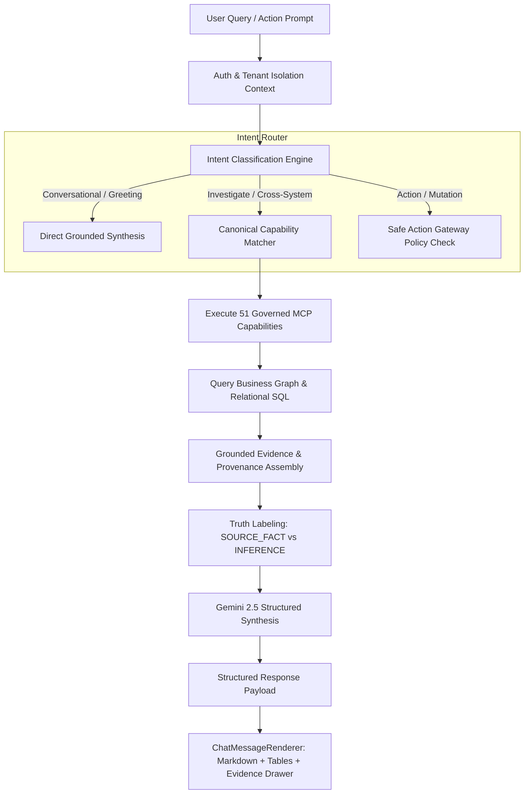

# SignalDesk — AI System Specification & Truth Model

**Document Identifier**: `DOC-AI-2026-V1`  
**Status**: `CANONICAL`  
**Owner**: AI Systems & Cognitive Architecture  
**Last Verified Against Implementation**: 2026-10-05  

---

## 1. Cognitive Architecture & Pipeline

SignalDesk AI operates as an **evidence-grounded operational reasoning engine** rather than an open-ended conversational bot. It utilizes the `@google/genai` TypeScript SDK interfacing with Gemini 2.5 Flash for sub-second execution and Gemini 2.5 Pro for complex counterfactual scenario simulations.



---

## 2. Intent Classification Taxonomy

Before invoking capabilities or querying the Business Graph, every prompt is triaged into an explicit intent class:

| Intent Class | Description | Tool Invocation Rule | Example Query |
| :--- | :--- | :--- | :--- |
| `CONVERSATION` | Basic conversational greeting or identity query. | **Zero tool calls**. Responds immediately. | "Hi SignalDesk, what can you do?" |
| `QUERY` | Structured retrieval of current business status. | Invokes read-only capability (`get_business_pulse`). | "What came in this morning?" |
| `SEARCH` | Universal keyword retrieval across documents and emails. | Traverses indexed vector and text entities. | "Find all emails from David Sterling regarding CSV." |
| `INVESTIGATE` | Cross-system root-cause correlation. | Multi-system traversal (CRM + Engineering + Billing). | "Why is the Acme Corp renewal delayed?" |
| `EXPLAIN` | Explains causal provenance of a signal or metric. | Inspects graph edges and source timestamps. | "Where does the $148,500 exposure number come from?" |
| `REPORT` | Generates structured executive memo or synthesis. | Synthesizes multiple canonical capabilities. | "Draft our Monday executive operating memo." |
| `DELEGATE` | Dispatches task to team member or autonomous agent. | Creates `BusinessMission` with step verification. | "Assign follow-up on overdue wire to Sarah." |
| `ACT` | Proposes external mutation write-back. | **Halts in Safe Action Gateway** for human sign-off. | "Send payment reminder to client for #INV-8821." |

---

## 3. Truth Levels & Evidence States

SignalDesk enforces strict evidence states to eliminate AI hallucination:

### 3.1 Evidence States
- `SUFFICIENT`: Complete provenance trail from authoritative APIs; high-confidence synthesis permitted.
- `PARTIAL`: Incomplete records (e.g. CRM deal exists, but contract document is missing). The AI must explicitly disclose the gap.
- `STALE`: Records exist but sync job has not run in > 24 hours. A freshness warning badge is attached.
- `CONFLICTING`: Contradictory evidence (e.g. HubSpot reports deal won, but QuickBooks shows invoice voided). The AI transparently highlights the conflict rather than averaging into false confidence.
- `MISSING`: Data does not exist in tenant store. The AI explicitly responds: *"No records found in connected systems for [query]."*

### 3.2 Canonical Truth Labels
Every operational claim, metric card, and AI recommendation displays an explicit truth tag:

```
┌───────────────────────────┬────────────────────────────────────────────────────────┐
│ Truth Label               │ Definition & Operational Boundary                      │
├───────────────────────────┼────────────────────────────────────────────────────────┤
│ SOURCE_FACT               │ Exact unmutated record from API (e.g. Stripe Invoice). │
│ DETERMINISTIC_DERIVATION  │ Exact arithmetic sum (e.g. Sum of overdue balances).   │
│ HEURISTIC                 │ Rule-based pattern (e.g. Inactive deal > 30 days).     │
│ AI_INFERENCE              │ LLM contextual extraction (e.g. Email sentiment).      │
│ RECOMMENDATION            │ Proposed action requiring human authorization.         │
│ SIMULATION                │ Counterfactual what-if forecast model.                 │
│ VERIFIED_OUTCOME          │ Post-action audit proof verified against source API.   │
└───────────────────────────┴────────────────────────────────────────────────────────┘
```

---

## 4. Deterministic Metric Rule

**Strict System Invariant**: Generative language models are strictly forbidden from calculating or estimating authoritative business metrics independently.

The following metrics are computed deterministically via SQL/TypeScript in `packages/intelligence/`:
- **Annual Recurring Revenue (ARR)**
- **Monthly Recurring Revenue (MRR) at Risk**
- **Accounts Receivable (AR) & Overdue Balances**
- **Days Sales Outstanding (DSO)**
- **Cash Runway Months & Cash Burn Rate**
- **Sprint Blocker Counts & SLA Breach Timers**

Whenever a metric appears in an AI response, it must be accompanied by its deterministic provenance query: *"Where did this number come from?"*
