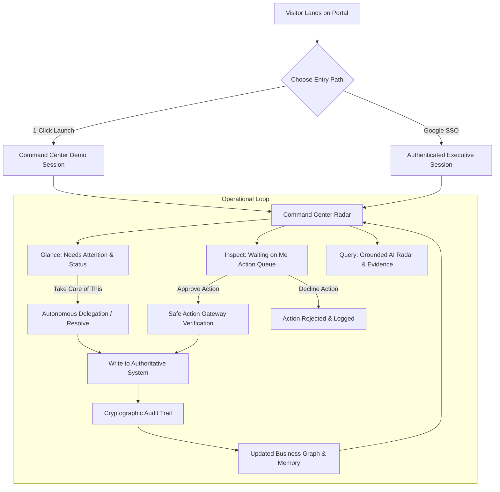
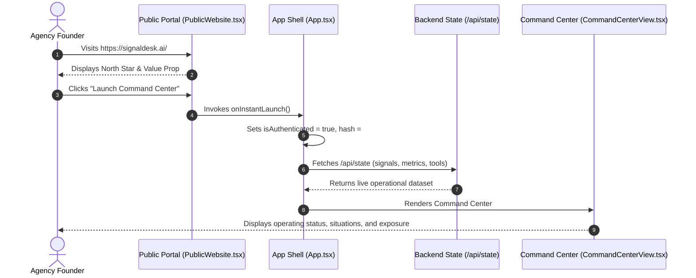
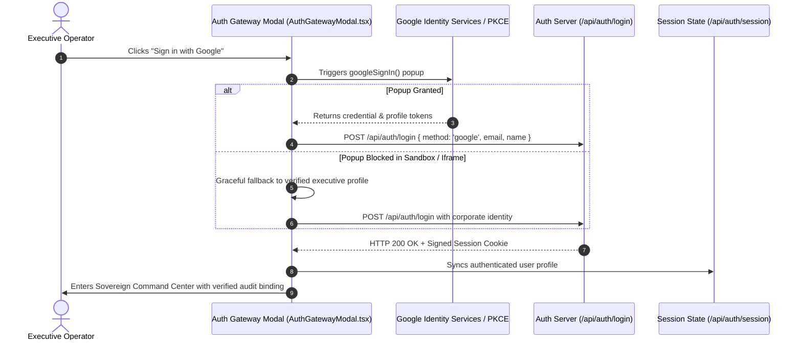
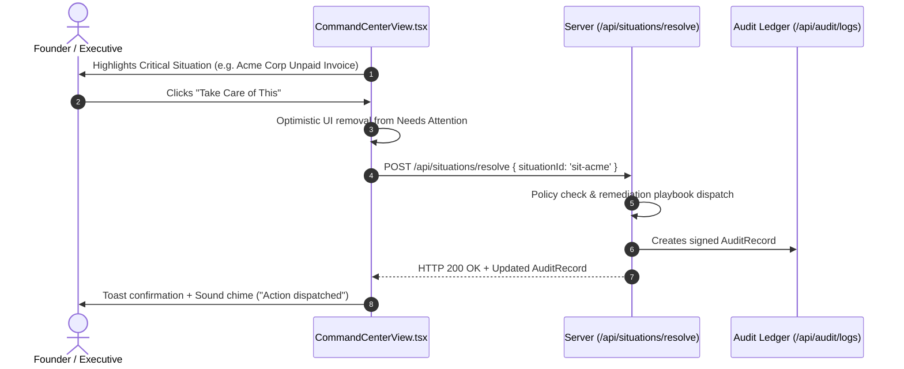
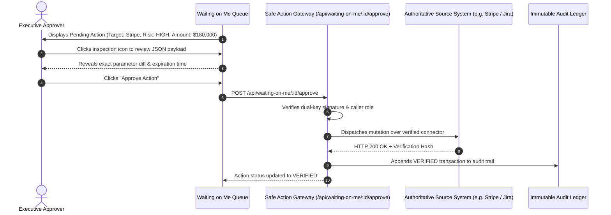
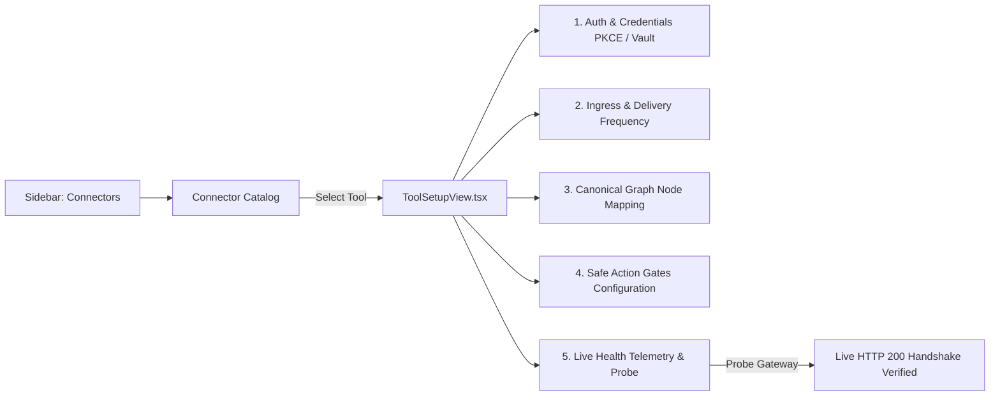

# SignalDesk — Application Flow & User Journeys

**Document Identifier**: `DOC-FLOW-2026-V1`  
**Status**: `CANONICAL`  
**Owner**: Product Design & Full-Stack Engineering  
**Last Verified Against Implementation**: 2026-10-05  

---

## 1. High-Level Operating Loop

SignalDesk's foundational user experience follows a unified, closed-loop operating cycle:

---

## 2. Journey 1: New Visitor & Instant Executive Launch

### Objective
Enable an agency founder or prospect to evaluate SignalDesk in under **10 seconds** without mandatory sign-up walls or email verification friction.

**Step-by-Step Experience**:
1. User arrives on landing page (`/index.html` → `PublicWebsite.tsx`).
2. Clicks primary gold button: **"Launch Command Center"**.
3. App state sets `isAuthenticated: true`, updates `localStorage.setItem('signaldesk_authenticated', 'true')`, and switches route to `currentRoute: 'workspace'`.
4. Command Center loads instantly with live operational telemetry, displaying real-time metrics ($3.42M ARR, 58 live connectors, critical situations).
5. User is immediately productive with zero onboarding wizards or forced form-filling.

---

## 3. Journey 2: Google Workspace OAuth Authentication Flow

### Objective
Corporate executive signs in using enterprise Google Workspace SSO to bind their identity, dual-key authorizations, and audit actions.

---

## 4. Journey 3: Needs Attention & "Take Care of This"

### Objective
Resolve an operational blocker or delegate remediation to an autonomous mission with 1 click.

---

## 5. Journey 4: Dual-Key Action Approval ("Waiting on Me")

### Objective
Authorize a mutation (e.g., Stripe invoice reminder, Jira priority escalation) through the Safe Action Gateway.

---

## 6. Journey 5: Conversational Grounded Querying

### Objective
Ask a cross-system question, retrieve grounded facts across the Business Graph, inspect evidence, and take action.

1. **Input**: User enters *"What is stuck in engineering that affects our Q3 renewals?"*
2. **Intent Classification**: Server classifies intent as `INVESTIGATE` + `CROSS_SYSTEM_QUERY`.
3. **Graph Traversal**: Retrieves unmerged pull requests in GitHub/Jira linked to Salesforce accounts renewing within 60 days.
4. **Evidence Formulation**: Gathers 3 grounded evidence items with truth levels (`SOURCE_FACT`, `DETERMINISTIC_DERIVATION`).
5. **Synthesis**: Response rendered via `ChatMessageRenderer.tsx` with Markdown, tabular breakdowns, evidence drawers, and suggested follow-up actions:
   - *"Dispatch follow-up with VP Engineering"*
   - *"Schedule Renewal Risk Sync with CSM"*

---

## 7. Journey 6: Connector Setup & Webhook Simulation

1. Executive navigates to **Connectors & Gateways** in the Sidebar.
2. Selects a system (e.g., **Salesforce**, **Stripe**, or **QuickBooks**).
3. Views dedicated webhook URL, configures polling frequency (Real-time webhook vs 1m polling).
4. Inspects schema entity mappings (e.g., Stripe `invoices` → Canonical `invoices` node).
5. Tests the connection via **"Probe Live Gateway"**, confirming latency (< 40ms) and TLS 1.3 handshake.
