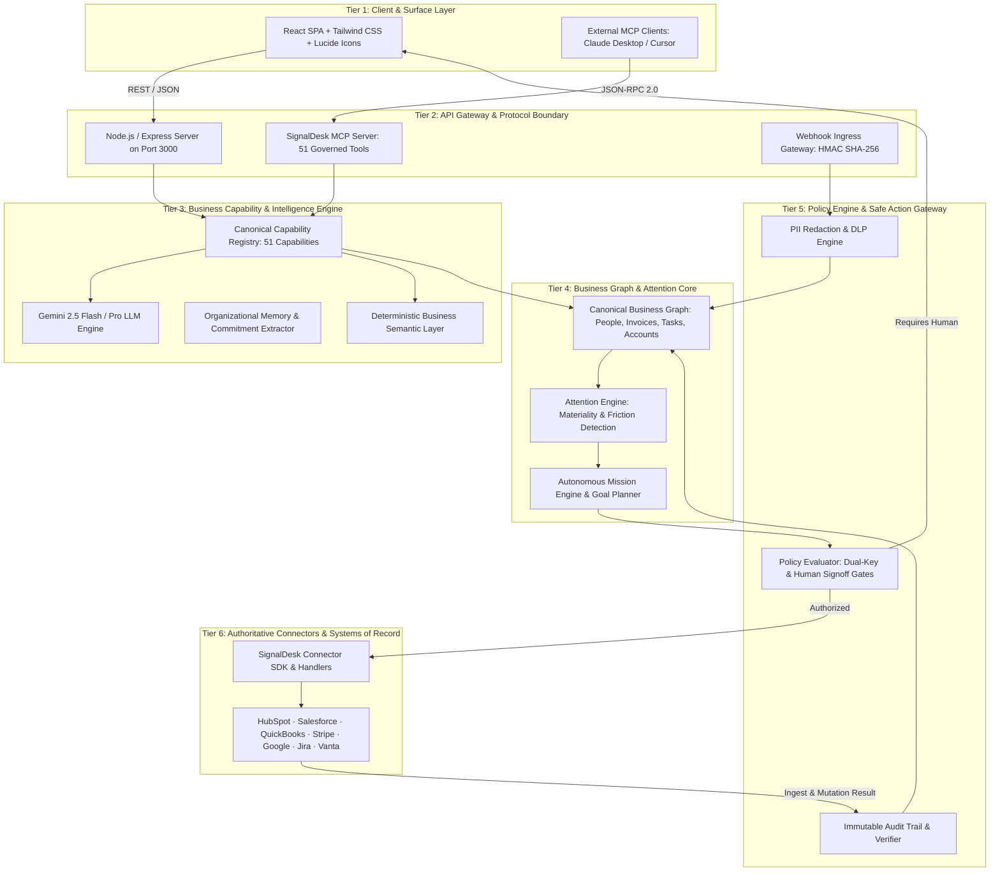
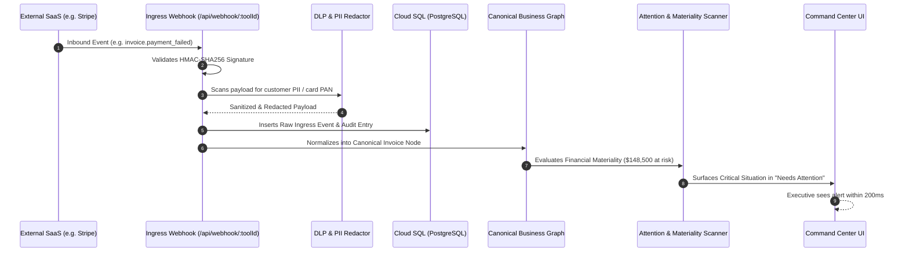

# SignalDesk — System Architecture & Technical Topology

**Document Identifier**: `DOC-ARCH-2026-V1`  
**Status**: `CANONICAL`  
**Owner**: Chief Architect & Engineering Lead  
**Last Verified Against Implementation**: 2026-10-05  

---

## 1. Architectural Philosophy & Layering

SignalDesk does not replace authoritative systems of record (CRM, accounting, communication, engineering). It sits above them as the company's **System of Intelligence, Attention, Delegation, and Governed Action**.

The architecture enforces strict separation of concerns across 6 distinct functional tiers:



---

## 2. Control Plane vs. Data Plane

| Dimension | Control Plane | Data Plane |
| :--- | :--- | :--- |
| **Primary Responsibility** | Tenant identity, OAuth credential lifecycle, policy definitions, dual-key authorizations, MCP discovery. | Webhook stream processing, delta sync, canonical entity normalization, entity graph querying. |
| **Components** | `src/server/credentialStore.ts`, `oauthProviderService.ts`, `canonicalCapabilityRegistry.ts`, `ActionApprovalDrawer.tsx`. | `server.ts` webhook endpoints, `packages/persistence/src/sync-jobs.ts`, `experienceEngine.ts`. |
| **Latency Target** | < 250ms for configuration and approval changes. | Sub-second streaming for webhooks; background batch for deep delta crawls. |
| **Security Envelope** | Isolated in Cloud Secret Manager; zero plaintext secrets in browser or client state. | Encrypted at rest (AES-256) and in transit (TLS 1.3). PII redacted before graph indexing. |

---

## 3. Core Runtime Components & Directory Structure

```
├── server.ts                         # Unified Express backend & development Vite middleware
├── packages/
│   ├── persistence/                  # Drizzle ORM PostgreSQL persistence layer
│   │   ├── src/schema.ts             # Authoritative multi-tenant SQL schema (50+ tables)
│   │   └── src/client.ts             # Database connection pool & tenant context
│   ├── intelligence/                 # Business semantic layer & metric computation
│   ├── signaldesk-connector-sdk/     # Connector definition interfaces & lifecycle contracts
│   └── signaldesk-mcp-sdk/           # MCP server & protocol communication testkit
├── src/
│   ├── App.tsx                       # Root application shell & routing router (#website, #workspace)
│   ├── components/
│   │   ├── CommandCenterView.tsx      # Main operating radar (Status, Needs Attention, Waiting on Me)
│   │   ├── PublicWebsite.tsx         # High-conversion public portal & proof strip
│   │   ├── AuthGatewayModal.tsx      # Google Workspace SSO & Instant Executive Demo Launch
│   │   ├── ConnectorLibrary.tsx      # 58+ SaaS integration directory & filter
│   │   ├── ToolSetupView.tsx         # Dedicated tool configuration, auth vault & diagnostics
│   │   ├── ConnectorSettings.tsx     # Webhook infrastructure, DLP rules, IP allowlists
│   │   └── HistoryView.tsx           # Cryptographic audit ledger
│   ├── server/
│   │   ├── canonicalCapabilityRegistry.ts # 51 Governed MCP capabilities registry
│   │   ├── catalog57.ts              # Canonical integration catalog specifications
│   │   └── realConnectorService.ts   # Live connector API execution & sync routines
│   └── services/
│       └── workspaceAuth.ts          # Client-side Google Workspace OAuth PKCE service
└── docs/                             # Canonical production documentation system
```

---

## 4. End-to-End Data Flow



---

## 5. Security & Isolation Architecture

1. **Multi-Tenancy Isolation**:
   - Every database query in `packages/persistence/src/` enforces `tenantId` parameter scoping or PostgreSQL Row-Level Security (RLS). Cross-tenant access is structurally prevented at the persistence layer.
2. **Hardware-Isolated Credential Vault**:
   - OAuth tokens, refresh tokens, and API secrets are never delivered to client browsers. They are encrypted using Cloud Secret Manager or AES-256-GCM.
3. **Dual-Key Policy Gate**:
   - When an automated playbook or agent attempts an external write (e.g. update ticket, send reminder), the gateway checks `autonomousGateLevel`. If `always_require_human` or `risk === 'high'`, the action halts in `APPROVAL_REQUIRED` until an authenticated executive signs off.
