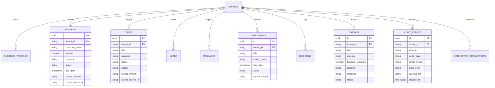

# SignalDesk — Data Model & Schema Specification

**Document Identifier**: `DOC-DATA-2026-V1`  
**Status**: `CANONICAL`  
**Source of Truth**: `packages/persistence/src/schema.ts`, `src/types.ts`  
**Owner**: Database Engineering & Persistence  
**Last Verified Against Implementation**: 2026-10-05  

---

## 1. Relational Persistence Architecture (PostgreSQL)

SignalDesk's relational data model is managed via **Drizzle ORM** in `packages/persistence/src/schema.ts`, targeting PostgreSQL 16 (Cloud SQL). All multi-tenant tables enforce strict tenant boundary isolation with non-null `tenantId` columns.

### 1.1 Core Entity-Relationship Diagram

---

## 2. Table Specifications & Column Definitions

### 2.1 `invoices` Table (`packages/persistence/src/invoices.ts`)
Stores accounts receivable, client billings, and payment statuses ingested from Stripe, QuickBooks, Xero, and CSVs.

| Column | Type | Constraints | Description |
| :--- | :--- | :--- | :--- |
| `id` | `uuid` | Primary Key, Default `gen_random_uuid()` | Internal unique identifier |
| `tenant_id` | `varchar(128)` | Not Null, Indexed | Tenant boundary identifier |
| `customer_name` | `varchar(255)` | Not Null | B2B account / client name |
| `amount` | `numeric(12, 2)` | Not Null | Total invoiced amount |
| `currency` | `varchar(3)` | Default `'USD'` | ISO 4217 currency code |
| `status` | `varchar(32)` | Not Null | `paid`, `open`, `overdue`, `void`, `draft` |
| `due_date` | `timestamp with time zone` | Nullable | Payment due date |
| `paid_at` | `timestamp with time zone` | Nullable | Settlement timestamp |
| `source_system` | `varchar(64)` | Not Null | `stripe`, `quickbooks`, `xero`, `csv` |
| `source_record_id` | `varchar(255)` | Not Null | Foreign ID in authoritative system |
| `created_at` | `timestamp with time zone` | Default `now()` | Ingestion timestamp |

### 2.2 `tasks` Table (`packages/persistence/src/tasks.ts`)
Stores project tickets, pull requests, and engineering deliverables ingested from Jira, Asana, Linear, and GitHub.

| Column | Type | Constraints | Description |
| :--- | :--- | :--- | :--- |
| `id` | `uuid` | Primary Key | Unique task identifier |
| `tenant_id` | `varchar(128)` | Not Null, Indexed | Tenant isolation ID |
| `title` | `varchar(512)` | Not Null | Task summary or PR title |
| `description` | `text` | Nullable | Detailed specifications |
| `assignee` | `varchar(255)` | Nullable | Responsible owner name or email |
| `status` | `varchar(64)` | Not Null | `todo`, `in_progress`, `blocked`, `done` |
| `priority` | `varchar(32)` | Default `'medium'` | `low`, `medium`, `high`, `urgent` |
| `due_date` | `timestamp with time zone` | Nullable | Committed completion deadline |
| `source_system` | `varchar(64)` | Not Null | `jira`, `asana`, `linear`, `github` |
| `source_record_id` | `varchar(255)` | Not Null | ID in source project tracker |

### 2.3 `audit_events` Table (`packages/persistence/src/audit-events.ts`)
Immutable audit log recording every system mutation, user approval, and autonomous agent action.

| Column | Type | Constraints | Description |
| :--- | :--- | :--- | :--- |
| `id` | `uuid` | Primary Key | Audit record ID |
| `tenant_id` | `varchar(128)` | Not Null, Indexed | Organization ID |
| `actor_id` | `varchar(128)` | Not Null | User ID or Agent ID |
| `actor_name` | `varchar(255)` | Not Null | Display name of actor |
| `action_type` | `varchar(128)` | Not Null | e.g. `MUTATION_APPROVED`, `SYSTEM_SYNC` |
| `target_system` | `varchar(64)` | Not Null | e.g. `hubspot`, `stripe`, `linear` |
| `truth_level` | `varchar(64)` | Not Null | e.g. `SOURCE_FACT`, `VERIFIED_OUTCOME` |
| `payload_diff` | `jsonb` | Nullable | Exact mutation parameter diff |
| `verification_hash`| `varchar(128)` | Nullable | Cryptographic HMAC outcome hash |
| `created_at` | `timestamp with time zone` | Default `now()` | Immutable timestamp |

---

## 3. Canonical Business Graph Entity Hierarchy

The Business Graph sits above relational storage as an interconnected, provenance-preserving semantic network:

1. **People**: `Executive`, `Employee`, `Client Contact`, `Vendor Lead`
2. **Accounts**: `Company Name`, `ARR`, `Contract Signed Date`, `Renewal Window`
3. **Invoices**: `Invoice ID`, `Due Date`, `Payment Gateway`, `Overdue Exposure`
4. **Deliverables (Tasks)**: `Task Title`, `Assigned Owner`, `Sprint Blocker Status`
5. **Signals**: `Detected Discrepancy`, `SLA Alarm`, `At-Risk Cashflow`
6. **Commitments**: `Promised Date`, `Counterparty`, `Fulfillment Proof`
7. **Decisions**: `Options Appraised`, `Approved Choice`, `Signed Authority`

---

## 4. Truth Levels & Provenance Invariants

Every node and edge in the Business Graph contains an immutable `truthLevel` tag:

- `SOURCE_FACT`: Verifiable raw record ingested directly from authoritative API (e.g. Stripe Invoice).
- `DETERMINISTIC_DERIVATION`: Statistically exact calculation (e.g. Total Overdue Invoices sum).
- `HEURISTIC`: Rule-based classification (e.g. "Ticket overdue because > 5 days without activity").
- `AI_INFERENCE`: Synthesis generated by language model (e.g. Client sentiment summary).
- `RECOMMENDATION`: Suggested follow-up action presented to executive for sign-off.
- `SIMULATION`: Counterfactual what-if forecast (e.g. "If this client churns, cash runway drops by 2.4 months").
- `VERIFIED_OUTCOME`: Post-mutation proof verified against authoritative source API.
