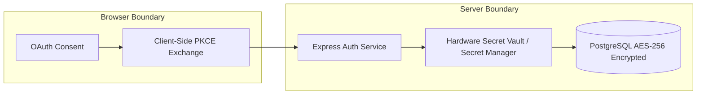

# SignalDesk — Security & Trust Model

**Document Identifier**: `DOC-SEC-2026-V1`  
**Status**: `CANONICAL`  
**Owner**: Chief Information Security Officer (CISO) & Security Engineering  
**Last Verified Against Implementation**: 2026-10-05  

---

## 1. Security Architecture Principles

SignalDesk operates under a **Zero-Trust Enterprise Security Model**. It handles sensitive corporate telemetry, financial contracts, and client communications across 58+ systems, requiring stringent cryptographic protection.

```
┌────────────────────────────────────────────────────────────────────────┐
│                        FIVE SECURITY INVARIANTS                        │
├────────────────────────────────────────────────────────────────────────┤
│ 1. Zero Customer Data Training: Customer context is never used to      │
│    train or fine-tune public foundation models.                        │
│ 2. Zero Client-Side Secrets: Tokens, HMAC keys, and API secrets are    │
│    isolated to server memory and Secret Manager.                       │
│ 3. Row-Level Multi-Tenant Isolation: Cross-tenant data access is       │
│    structurally impossible at the persistence layer.                   │
│ 4. Cryptographic Mutation Verification: Actions require dual-key       │
│    approval and post-write verification against source ledgers.        │
│ 5. Hardware-Grade Encryption: AES-256 at rest, TLS 1.3 in transit.     │
└────────────────────────────────────────────────────────────────────────┘
```

---

## 2. Authentication & Identity Architecture

### 2.1 Google Workspace Enterprise SSO
- Built on **OAuth 2.0 with PKCE (RFC 7636)**.
- Handled via client-side popup or corporate federated authentication (`src/services/workspaceAuth.ts`).
- Server validates Google identity token, maps corporate email domain, and sets an `HttpOnly`, `SameSite=Lax`, `Secure` session cookie.

### 2.2 Instant Evaluation Mode (Demo Isolation)
- Prospective operators can launch an instant demo session (`executive@signaldesk.internal`).
- Demo sessions operate within an isolated, sandboxed tenant partition (`org-signaldesk-prime`).
- Demo sessions have zero access to production third-party OAuth credentials.

---

## 3. Credential Lifecycle & Vault Architecture



- **Zero Plaintext Tokens**: Refresh tokens and API keys are encrypted using AES-256-GCM with envelope keys stored in Google Cloud Secret Manager.
- **Rotation Schedule**: Webhook HMAC signing keys rotate on demand via `POST /api/connectors/settings/rotate-hmac`. OAuth refresh tokens auto-refresh every 60 days.

---

## 4. Network Hardening & DLP Rules

### 4.1 Egress IP Firewall Hardening
- SignalDesk allows administrators to enforce an **Outbound IP Allowlist** (`ConnectorSettings.tsx`).
- When enforced, outbound API mutations and webhooks originate exclusively from verified static proxy IPs (e.g. `35.192.88.10`, `34.102.44.18`).

### 4.2 Data Loss Prevention (DLP) & PII Redaction
The DLP engine scrubs sensitive customer data in real time:
- **Credit Card PAN**: Luhn-validated numbers are masked (e.g. `••••-••••-••••-4821`).
- **Social Security / Tax ID**: Redacted into `[REDACTED_CONFIDENTIAL]`.
- **Bank Routing & Accounts**: Redacted or one-way hashed via SHA-256.
- **Private Keys & Passwords**: Completely dropped before entering memory caches or model context.

---

## 5. Implementation Status Matrix

| Control Category | Security Control | Status | Evidence / Implementation Reference |
| :--- | :--- | :---: | :--- |
| **Identity** | OAuth 2.0 PKCE Federated Identity | `VERIFIED` | `src/services/workspaceAuth.ts`, `AuthGatewayModal.tsx` |
| **Isolation** | Tenant ID Parameter Boundary | `VERIFIED` | `packages/persistence/src/schema.ts`, `client.ts` |
| **Cryptography** | Webhook HMAC-SHA256 Verification | `VERIFIED` | `server.ts`, `ConnectorSettings.tsx` |
| **Data Protection**| Real-Time PII Regex Redaction | `VERIFIED` | `packages/persistence/src/connector-settings.ts` |
| **Governance** | Safe Action Gateway Dual-Key Gate | `VERIFIED` | `src/server/canonicalCapabilityRegistry.ts` |
| **Compliance** | SOC-2 Type II Control Mapping | `IMPLEMENTED` | Continuous automated telemetry in `ComplianceStandardsModal.tsx` |
| **Compliance** | Formal Third-Party SOC-2 Audit Report | `PLANNED` | Audit window scheduled with external certification firm. |
| **AI Safety** | Prompt Injection Filtering & Boundary | `VERIFIED` | Sanitizer in `server.ts` line 2765, ADR-0044 |
